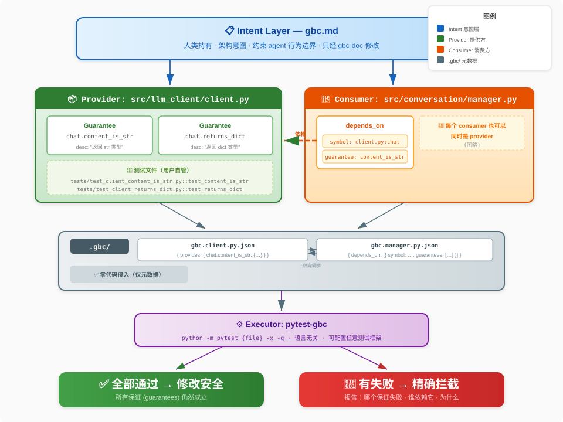

# Guarantee-Based Coding (GBC)

**与其指望 AI 更聪明，不如让再笨的 agent 也改不坏你的代码。**

**English version: [README_EN.md](./README_EN.md)**

## 🚀 想让你的 Agent 用上 GBC?

几乎不用你动手——交给你的 coding agent 就好。先看你是谁:

- **你是人类** → [docs/for-humans.md](./docs/for-humans.md)
- **你是 agent** → [docs/for-agents.md](./docs/for-agents.md) (English / 英文版)

想亲自动手、或弄清每一步:[docs/manual.md](./docs/manual.md)(手动 / 详细文档)。

## 🎬 先看演示

先看看 GBC 报错时的真实样子。精确定位：哪个保证坏了、报错信息是什么。

```text
RED  passed=0 failed=1 skipped=0
failed: config_loader.get_config.never_none

── config_loader.get_config.never_none ──
...
E       AssertionError: assert None is not None
E        +  where None = get_config()

tests/test_never_none.py:12: AssertionError

=========================== short test summary info ============================
FAILED tests/test_never_none.py::test_get_config_never_returns_none - Asserti...
1 failed in 0.08s
```

几乎零配置就能跑；菜单里中/英剧本都有。

```bash
pip install -r demo/requirements.txt
python demo/run_demo.py
```

| 剧本 | 演示什么 |
|------|----------|
| `config-service-strong` / `*-en` | **成功拦截**——强测试覆盖边缘路径 (Edge Path)，改坏代码后触发 RED 拦截 |
| `config-service-weak` / `*-en` | **拦截失败**——弱测试只覆盖正常路径 (Happy Path)，改坏代码后仍为 GREEN |
| `config-service-bad-test` / `*-en` | **注册即验证 (Born-Green)**——测试本身有 Bug，登记保证时当场拒绝 |
| `workflow-before-after` / `*-en` | **作业模式对比**——对比集成 GBC 前后的开发逻辑：从「随意修改」到「规划、对齐意图、派发任务、登记保证与最终验收」的流程演进 |

每个门禁剧本都是真跑 MCP + pytest。工作流剧本偏「agent 怎么想、怎么做」的叙事对照。

> **交给 agent 走读**：[demo/EXAMPLE.md](./demo/EXAMPLE.md)（中）/ [demo/EXAMPLE_EN.md](./demo/EXAMPLE_EN.md)（英）——对它说「按这个走一遍」。

详见 [demo/](./demo/)。


## 问题

Coding agents（Cursor, Aider, Devin 等）的核心失败模式不是写错代码——写错可以重试。真正的问题是**静默地破坏已有代码的隐含假设**。

当 Agent 修改了一个函数的返回格式，项目中其他依赖这个格式的模块可能会悄悄坏掉。没有任何机制告诉 Agent 这些依赖的存在，也没有任何机制在破坏发生时阻止它。

现有的 coding agents 主要优化的是上下文检索和 token 效率。但它们没有解决一个更基本的问题：

> **修改代码时，怎么知道什么不能被破坏？**

## 核心想法

代码之间的依赖关系本质上是一组**保证（guarantees）**。模块 A 依赖模块 B，不是依赖 B 的实现细节，而是依赖 B 的某些行为承诺——返回值的类型、格式、语义。

如果我们把这些保证从隐含变为**显式的、可执行的、可验证的**，那么：

- 每次修改时，自动验证所有保证是否仍然成立
- 如果某个保证被打破，精确知道是哪个保证、谁依赖它
- **正确性的判定从"AI 觉得自己改对了"变成"所有保证仍然通过"**——一个可以机械验证的布尔条件


## 它怎么工作



### 设计原则

1. **源码零侵入**：所有元数据存放在 `.gbc/` 目录下，不修改源代码、不增加装饰器/注解。Setup 会增加一个 `.mcp.json` 并向 agent 指令文件（如 `CLAUDE.md`）添加 rules 块。
2. **测试文件由用户管理**：GBC 不生成、不存储、不管理测试文件本身。用户在自己的项目目录里用自己喜欢的方式组织测试文件。GBC 只负责**记录哪些测试文件是哪些保证、运行它们、汇总结果**
3. **语言无关**：通过 executor 配置支持任何语言和测试框架

### 目录结构

```
my-project/
├── src/                                    # 你的代码
│   ├── llm_client/
│   │   └── client.py
│   └── conversation/
│       └── manager.py
│
├── tests/                                  # 你的测试文件，你自己管理
│   ├── test_client_returns_dict.py
│   ├── test_client_content_is_str.py
│   └── ...
│
└── .gbc/                                   # GBC 元数据目录（自动生成）
    ├── gbc.md                              # 意图层：定义文件夹/架构的语义契约
    └── src/
        └── llm_client/
            └── gbc.client.py.json          # 行为层：记录保证注册信息
```

### 两层契约

GBC 通过两层契约来锁定变更影响：

1. **意图层 (Intent)**：存放于 `.gbc/**/gbc.md`。使用自然语言（Markdown）定义文件夹的职责、内部约束和架构意图。它是「真理之源」，告诉 Agent「你在这里该做什么、不该做什么」。
2. **行为层 (Guarantee)**：存放于 `.gbc/**/*.json`。这是可执行的、被测试覆盖的具体行为承诺。

当 Agent 修改代码时，它必须同时遵守意图层（不违背开发初衷）和行为层（不破坏具体功能）。

### 核心概念

- **Provider**：提供保证的源文件（如 `src/llm_client/client.py`）
- **Consumer / Dependent**：依赖某保证的文件（如 `src/conversation/manager.py`）
- **Guarantee**：一条**具名**（全局唯一 id）的行为承诺，对应一个测试 + 一段描述；**多个 consumer 可共享同一条保证**
- **Executor**：定义如何运行测试的配置（命令模板、工作目录、环境变量等）

依赖边分为两个层级：轻量级的**符号依赖**（仅依赖签名或符号存在）与强约束的**具名保证依赖**（依赖具体行为）。后者通过反向边机制实现**双向登记**——提供方的 `provides[id].dependents` ⇄ 消费者的 `depends_on[].guarantees`，由工具链确保状态同步。

### Meta 文件示例

每个源文件可有一个同名 `.json`，记两件事:它**提供**了哪些保证（`provides`）、它**依赖**了谁（`depends_on`）。

`client.py`（provider）的 `.gbc/src/llm_client/gbc.client.py.json`：

```json
{
    "provides": {
        "llm_client.client.chat.content_is_str": {
            "desc": "chat() 返回的 result['content'] 是 str；manager 直接用它拼接对话历史",
            "test": "tests/test_client_content_is_str.py::test_content_is_str",
            "executor": "pytest",
            "heavy": 0,
            "dependents": ["src/conversation/manager.py"]
        }
    }
}
```

`manager.py`（consumer）的 `.gbc/src/conversation/gbc.manager.py.json` 登记反向边：

```json
{
    "depends_on": [
        {
            "symbol": "src/llm_client/client.py:chat",
            "guarantees": ["llm_client.client.chat.content_is_str"]
        }
    ]
}
```

*   `heavy`: 成本等级。0 表示轻量级测试（默认运行），>0 表示重量级测试（批量验证时默认跳过）。

保证 id 全局唯一（`<点分路径>.<符号>.<行为>`）；两个方向都由工具（CLI/MCP）双向写入，你不手编。

### Executor 配置示例

Executor 定义了如何运行测试。`{file}` 是占位符，运行时替换为 guarantee 的测试文件路径：

```json
{
    "executors": {
        "pytest": {
            "command": ["python", "-m", "pytest", "{file}", "-x", "-q"],
            "cwd": "/path/to/my-project",
            "timeout": 30,
            "env_ops": [
                {"key": "PYTHONPATH", "action": "prepend", "value": "/path/to/my-project/src"}
            ]
        },
        "jest": {
            "command": ["npx", "jest", "{file}"],
            "cwd": "/path/to/my-project",
            "timeout": 30,
            "env_ops": null
        }
    }
}
```

支持的环境变量操作：`set`、`append`、`prepend`、`remove`。

> ⚠️ **安全提示**：Executor 配置本质上允许运行任意 shell 命令。请务必审计 agent 写入的 executor 配置，确保其安全可控。

### 工作流程

```
修改 client.py
       │
       ▼
verify_provider(src/llm_client/client.py)
       │
       ├── 运行 tests/test_client_content_is_str.py  (for manager.py)
       ├── 运行 tests/test_client_returns_dict.py     (for handler.py)
       │
       ▼
  全部通过 → 修改安全
  有失败   → 精确报告：哪个保证失败、谁依赖它、为什么
```

### 与 Coding Agent 的集成

GBC 提供两组集成点，CLI 与 MCP 皆可：

- **修改前**：`list_provides` / `list_depends_on` / `who_depends_on` — agent 了解文件有哪些保证、依赖了谁、谁依赖它
- **登记**：`add_dependency` / `create_guarantee` — 把"我依赖你的某行为"显式登记（具名保证出生即跑测）
- **修改后**：`verify_provider` / `verify_guarantee` — 运行保证，门控修改是否可接受

上下文大小取决于当前文件的 guarantee 数量，**与项目整体规模无关**。

GBC 同时提供 **CLI 和 MCP** 两种接口；并给出一套**推荐的 agent 工作流**——把 [docs/for-agents.md](./docs/for-agents.md) 交给你的 agent 即可上手。

## 它不是什么，它和谁配合？

GBC **不是**另一个要挑战 Cursor 或 Aider 的 AI 编程助手。相反，它是为了填补它们在大型复杂项目中缺失的一环：**机器可判定（Machine-Verifiable）的变更边界**。

- **与 Cursor/Aider 配合**：它们擅长寻找代码并完成修改，但由于缺乏对跨模块依赖的显式感知，容易引发静默破坏。GBC 为这些 Agent 提供了一层「约束护栏」——修改前，Agent 查阅依赖树；修改后，Agent 必须跑通所有相关的 Guarantee。
- **与 CI 系统的区别**：CI 是「事后」的，通常在代码提交后才发现错误。GBC 是「准入制」的，它是 Agent 工作流中的一个门禁（Gate），错误在代码落地前就被拦截在 Agent 的上下文中。

GBC 的核心价值是**正交性**：它并不让 AI 变得「更聪明」，而是通过降低对「语义理解」的依赖，确保即使是能力有限的 Agent 也无法绕过你定义的行为契约。

## 和已有概念的区别

**"这不就是 Design by Contract 吗？"**

传统契约式编程是模块**自己**声明自己的契约。GBC 的关键区别是：

- **Guarantee 是依赖方注册的**——"我依赖你的什么行为"来自使用者，不是提供者
- **带归属信息**——知道是谁注册的、为什么，打破时可以精确定位影响范围
- **设计目标是 AI agent**——为 coding agent 提供修改边界，而非运行时检查

**"这不就是测试吗？"**

技术上，guarantee 就是测试文件。概念上的区别：

- **带归属**：每条 guarantee 记录了谁注册的、保护的是什么跨模块依赖
- **实时门控**：不是 CI 里事后跑的，而是 agent 修改代码时的准入条件
- **用户自管**：GBC 不管理测试文件本身，只管理元数据和运行

## 路线图

🚧 **当前：Python 原型验证**

- [x] 核心保证注册 / 验证 / 更新 / 注销机制（具名保证 id、多对一、退休保护、反查）
- [x] 多语言 executor 配置
- [x] 原子文件写入 + 备份机制
- [x] CLI 接口
- [x] MCP 接口
- [x] Demo Runner（交互式演示系统，对比弱测试 vs 强测试的门禁效果）
- [x] 使用文档（[docs/](./docs/)）
- [ ] 完整测试覆盖
- [ ] **TypeScript 重写**，发布到 npm

> **注**：本项目目前处于原型阶段。虽然核心逻辑已在内部私有项目中进行了「吃螃蟹」验证，但本工具仓自身的 .gbc 注册工作仍在进行中。

## 局限性与说明

- **保护能力上限 = 测试质量**：GBC 只能拦截测试能抓到的错误。如果测试只走 Happy Path，那么保证就是虚假的安全感。**Demo 剧本中专门包含了一个 weak-test 场景来展示这种局限性。**
- **手动登记负担**：依赖关系需要 Agent 或人类主动登记。虽然单次登记的开销很小，但随着项目规模增长，覆盖率的提升需要持续投入。
- **运行性能**：由于每次验证都是真实运行测试，存在一定的延迟成本。
- **原型阶段**：目前为 Python 实现在验证想法，尚未实现 TS 重构，且工具仓自身的测试覆盖仍不完整。

## 许可

本项目采用 [Apache-2.0](./LICENSE) 许可证。

## 联系

如果你对这个方向感兴趣，欢迎 star、issue 或者直接联系我。