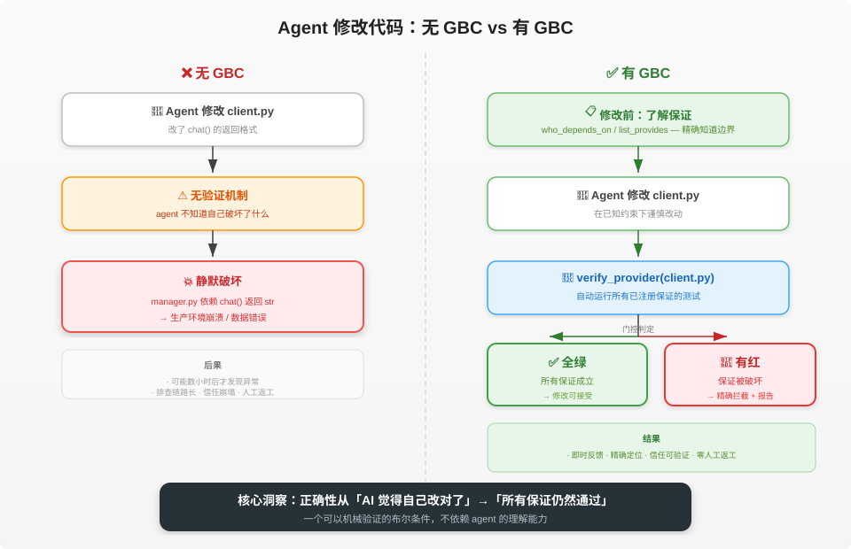

# Guarantee-Based Coding (GBC)

**与其指望 AI 更聪明，不如让再笨的 agent 也改不坏你的代码。**

**English version: [README_EN.md](./README_EN.md)**

GBC 把「这次改动会不会悄悄碰坏别处」从一种担心，变成可以当场验证的事实：你在意的行为被登记成
一条条带测试的**保证（guarantee）**，每次改完一跑——全绿就安心，有红就精确告诉你碰坏了谁、谁在
依赖它。

---

## 🚀 快速开始

```bash
pip install guarantee-based-coding
gbc setup        # 打印本地化接线指南：怎么把 MCP / skills 接入你的 agent
```

装好后 `gbc` 命令即在 PATH 上。完整上手（安装 → 接入 agent → 冒烟验证）见
**[docs/zh/quick-start.md](./docs/zh/quick-start.md)**。

想让 agent 替你接入？把 **[docs/zh/onboarding-agent.md](./docs/zh/onboarding-agent.md)** 交给它。

---

## 🎬 先看演示

先看看 GBC 报错时的真实样子——精确定位：哪个保证坏了、报错信息是什么。

```text
RED  passed=0 failed=1 skipped=0
failed: config_loader.get_config.never_none

── config_loader.get_config.never_none ──
E       AssertionError: assert None is not None
E        +  where None = get_config()
tests/test_never_none.py:12: AssertionError
1 failed in 0.08s
```

几乎零配置就能跑；菜单里中/英剧本都有：

```bash
pip install -r demo/requirements.txt
python demo/run_demo.py
```

| 剧本 | 演示什么 |
|------|----------|
| `config-service-strong` / `*-en` | **成功拦截**——强测试覆盖边缘路径，改坏代码后触发 RED 拦截 |
| `config-service-weak` / `*-en` | **拦截失败**——弱测试只覆盖正常路径，改坏代码后仍为 GREEN |
| `config-service-bad-test` / `*-en` | **出生即绿**——测试本身有 Bug，登记保证时当场拒绝 |
| `workflow-before-after` / `*-en` | **作业模式对比**——集成 GBC 前后的开发逻辑演进 |

> **交给 agent 走读**：[demo/EXAMPLE.md](./demo/EXAMPLE.md)（中）/ [demo/EXAMPLE_EN.md](./demo/EXAMPLE_EN.md)（英）——对它说「按这个走一遍」。详见 [demo/](./demo/)。

---

## 📚 文档

| 你想 | 看这里 |
|------|--------|
| 装好并跑起来 | [快速开始](./docs/zh/quick-start.md) |
| 懂 GBC 在保护什么 | [核心概念](./docs/zh/concepts.md) |
| 在 GBC 下安全改代码 | [工作流](./docs/zh/workflow.md) |
| 查命令 / 工具 / executor | [参考手册](./docs/zh/reference.md) |
| 你是 agent，被要求接入 GBC | [Agent 上手](./docs/zh/onboarding-agent.md) |

English docs: [docs/en/](./docs/en/)。

---

## 核心想法

代码之间的依赖本质上是一组**保证**。模块 A 依赖模块 B，不是依赖它的实现细节，而是依赖它的某些
行为承诺——返回值的类型、格式、语义。把这些保证从隐含变成**显式、可执行、可验证**，正确性的判定
就从「AI 觉得自己改对了」变成「所有被依赖的保证仍通过」——一个可机械验证的布尔条件。



GBC **不是**另一个要挑战 Cursor / Aider 的 AI 编程助手，而是填补它们在大型项目里缺的一环：
**机器可判定的变更边界**。它与那些 agent 配合——改前查依赖树，改后必须跑通所有相关保证；也区别
于 CI——CI 是事后的，GBC 是准入制的门禁，错误在落地前就被拦在 agent 的上下文里。

完整概念、架构图、与已有概念（Design by Contract / 测试）的区别，见
[核心概念](./docs/zh/concepts.md)。

---

## 当前状态

GBC 目前是一个可用的 Python 分发包（`pip install guarantee-based-coding`），自身用 GBC 管理自己的
`.gbc/`（dogfooding）：

- ✅ 核心保证机制（具名 id、多对一、出生即绿、退休保护、反查）
- ✅ 多语言 executor 配置
- ✅ CLI + MCP 双接口（含意图文档 `gbc doc` 全进 MCP）
- ✅ 意图文档子系统（`gbc doc` / web 编辑器）
- ✅ 随包分发的接线指南（`gbc setup`）与 CLI-only agent 的 skill 包
- ✅ 原子文件写入 + 备份
- ✅ 交互式 Demo Runner（弱/强测试门禁对比）

**诚实的局限**：保护能力上限 = 测试质量（测试只走 happy path 就是虚假安全感）；依赖需主动登记，
覆盖率随项目增长需持续投入；每次验证真实跑测试，有一定延迟。详见
[核心概念 · 局限性](./docs/zh/concepts.md#局限性诚实地说)。

---

## 许可

本项目采用 [Apache-2.0](./LICENSE) 许可证。

## 联系

如果你对这个方向感兴趣，欢迎 star、issue 或者直接联系我。
