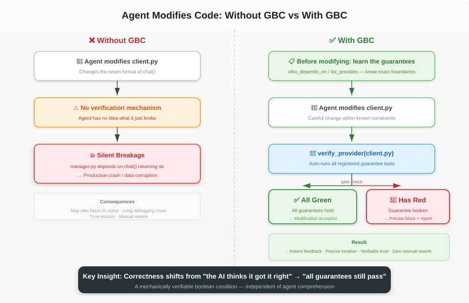

# Guarantee-Based Coding (GBC)

**Instead of betting on a smarter AI, make your code so even a dumb agent can't break it.**

**中文版: [README.md](./README.md)**

## 🚀 Want your agent to use GBC?

You'll barely lift a finger — hand it to your coding agent. Pick whoever you are:

- **You're a human** → [docs/for-humans_EN.md](./docs/for-humans_EN.md)
- **You're an agent** → [docs/for-agents.md](./docs/for-agents.md)

Prefer to do it by hand, or to understand each step: [docs/manual_EN.md](./docs/manual_EN.md) (the manual / detailed reference).

## 🎬 Try the demo first

Here is what a real GBC error looks like. Precise localization: which guarantee failed and why.

```text
RED  passed=0 failed=1 skipped=0
failed: config_loader.get_config.never_none

── config_loader.get_config.never_none ──
...
E       AssertionError: assert None is not None
E        +  where None = get_config()

tests/test_never_none.py:12: AssertionError

=========================== short test summary info ============================
FAILED tests/test_never_none.py::test_get_config_never_returns_none - Asserti...
1 failed in 0.08s
```

Almost zero setup. The menu lists Chinese and English scenarios.

```bash
pip install -r demo/requirements.txt
python demo/run_demo.py
```

| Scenario | What it shows |
|----------|----------------|
| `config-service-strong` / `*-en` | **Successful Catch** — strong test covers the edge path; RED gate blocks the break |
| `config-service-weak` / `*-en` | **Failed Catch** — weak test only covers the happy path; remains GREEN despite breakage |
| `config-service-bad-test` / `*-en` | **Born-Green Rejection** — buggy test rejected at the point of registration |
| `workflow-before-after` / `*-en` | **Workflow Comparison** — solo main-agent drift vs. structured planning, intent approval, and task dispatching |

Gate scenarios are live MCP + pytest. Workflow scenarios are a narrative of how the agent thinks and acts.

> **Hand to your agent**: [demo/EXAMPLE.md](./demo/EXAMPLE.md) (ZH) / [demo/EXAMPLE_EN.md](./demo/EXAMPLE_EN.md) (EN) — “walk through this”.

See [demo/](./demo/).


## The Problem

The core failure mode of coding agents (Cursor, Aider, Devin, etc.) isn't writing wrong code — wrong code can be retried. The real problem is **silently breaking implicit assumptions in existing code**.

When an agent modifies a function's return format, another module 12 directories away might depend on that format. Nothing tells the agent this dependency exists, and nothing prevents the breakage from happening.

Existing coding agents optimize for context retrieval and token efficiency. But they don't address a more fundamental question:

> **When modifying code, how do you know what must not break?**

## Core Idea

Dependencies between code modules are essentially a set of **guarantees**. Module A depends on Module B not because of B's implementation details, but because of B's behavioral promises — return types, formats, semantics.

If we make these guarantees **explicit, executable, and verifiable**, then:

- Every modification automatically checks whether all guarantees still hold
- If a guarantee breaks, you know exactly which one and who depends on it
- **Correctness shifts from "the AI thinks it got it right" to "all guarantees still pass"** — a mechanically verifiable boolean condition



## How It Works


### Design Principles

1. **Zero source-code intrusion**: All metadata lives in a `.gbc/` directory; no decorators, no imports, no changes to your source files. Setup adds an `.mcp.json` and a rules block to your agent instruction file.
2. **User-managed test files**: GBC does not generate, store, or manage test files. You organize your test files however you like in your own project. GBC only **records which test files correspond to which guarantees, runs them, and aggregates results**
3. **Language-agnostic**: Supports any language and test framework through executor configuration

### Directory Structure

```
my-project/
├── src/                                    # Your code
│   ├── llm_client/
│   │   └── client.py
│   └── conversation/
│       └── manager.py
│
├── tests/                                  # Your test files, managed by you
│   ├── test_client_returns_dict.py
│   ├── test_client_content_is_str.py
│   └── ...
│
└── .gbc/                                   # GBC metadata directory (auto-generated)
    ├── gbc.md                              # Intent Layer: defines semantic contracts for folders
    └── src/
        └── llm_client/
            └── gbc.client.py.json          # Behavior Layer: records guarantee registry
```

### Two-Layer Contract

GBC uses a dual-layer approach to pin down the impact of changes:

1. **Intent Layer**: Stored in `.gbc/**/gbc.md`. Uses natural language (Markdown) to define folder responsibilities, internal constraints, and architectural intent. It's the "Source of Truth" that tells the agent, "This is what you should and shouldn't do here."
2. **Behavior Layer (Guarantee)**: Stored in `.gbc/**/*.json`. These are executable, test-backed promises of specific behavior.

When an agent modifies code, it must adhere to both the Intent Layer (not violating the design philosophy) and the Behavior Layer (not breaking specific functionality).

### Core Concepts

- **Provider**: The source file that provides guarantees (e.g., `src/llm_client/client.py`)
- **Consumer / Dependent**: The file that depends on a guarantee (e.g., `src/conversation/manager.py`)
- **Guarantee**: A **named** (globally-unique id) behavioral promise, mapped to a test + a description; **multiple consumers can share one guarantee**
- **Executor**: Configuration defining how to run tests (command template, working directory, environment variables, etc.)

Dependency edges come in two levels: a free **symbol dependency** (on a signature/symbol existing) and a **named-guarantee dependency** (on a specific behavior). The latter is **registered bidirectionally** — the provider's `provides[id].dependents` ⇄ the consumer's `depends_on[].guarantees`, kept in sync by the tools.

### Meta File Example

Each source file may have a sibling `.json` recording two things: what guarantees it **provides** (`provides`) and what it **depends on** (`depends_on`).

`client.py` (provider) at `.gbc/src/llm_client/gbc.client.py.json`:

```json
{
    "provides": {
        "llm_client.client.chat.content_is_str": {
            "desc": "chat() returns result['content'] as str; manager uses it directly to build conversation history",
            "test": "tests/test_client_content_is_str.py::test_content_is_str",
            "executor": "pytest",
            "heavy": 0,
            "dependents": ["src/conversation/manager.py"]
        }
    }
}
```

`manager.py` (consumer) at `.gbc/src/conversation/gbc.manager.py.json` registers the reverse edge:

```json
{
    "depends_on": [
        {
            "symbol": "src/llm_client/client.py:chat",
            "guarantees": ["llm_client.client.chat.content_is_str"]
        }
    ]
}
```

*   `heavy`: Cost rank. 0 for lightweight tests (run in batch), >0 for heavy tests (skipped by default in batch verify).

Guarantee ids are globally unique (`<dotted.path>.<symbol>.<behavior>`); both directions are written by the tools (CLI/MCP) — you don't hand-edit them.

### Executor Configuration Example

Executors define how tests are run. `{file}` is a placeholder replaced at runtime with the guarantee's test file path:

```json
{
    "executors": {
        "pytest": {
            "command": ["python", "-m", "pytest", "{file}", "-x", "-q"],
            "cwd": "/path/to/my-project",
            "timeout": 30,
            "env_ops": [
                {"key": "PYTHONPATH", "action": "prepend", "value": "/path/to/my-project/src"}
            ]
        },
        "jest": {
            "command": ["npx", "jest", "{file}"],
            "cwd": "/path/to/my-project",
            "timeout": 30,
            "env_ops": null
        }
    }
}
```

Supported environment variable operations: `set`, `append`, `prepend`, `remove`.

> ⚠️ **Security Note**: Executor configurations run arbitrary shell commands. Always review and approve executor configs, especially when they are written by an agent.

### Workflow

```
Modify client.py
       │
       ▼
verify_provider(src/llm_client/client.py)
       │
       ├── Run tests/test_client_content_is_str.py  (for manager.py)
       ├── Run tests/test_client_returns_dict.py     (for handler.py)
       │
       ▼
  All pass  → Modification is safe
  Failure   → Precise report: which guarantee failed, who depends on it, why
```

### Integration with Coding Agents

GBC provides two sets of integration points, available via both CLI and MCP:

- **Before modification**: `list_provides` / `list_depends_on` / `who_depends_on` — the agent learns what guarantees a file has, what it depends on, and who depends on it
- **Registration**: `add_dependency` / `create_guarantee` — explicitly record "I depend on this behavior of yours" (a named guarantee is run-on-birth)
- **After modification**: `verify_provider` / `verify_guarantee` — run guarantees to gate whether the change is acceptable

Context size depends on the number of guarantees for the current file, **not on overall project size**.

GBC offers **both CLI and MCP** interfaces, plus a **recommended agent workflow** — just hand [docs/for-agents.md](./docs/for-agents.md) to your agent to get started.

## What GBC is NOT, and how it fits in

GBC is **NOT** another AI coding assistant meant to compete with Cursor or Aider. Instead, it fills the missing link in complex projects: **Machine-Verifiable change boundaries**.

- **With Cursor/Aider**: They are great at finding and editing code, but they lack explicit awareness of cross-module dependencies, leading to silent breakages. GBC provides a "constraint guardrail" — before a change, the agent consults the dependency tree; after the change, all related guarantees must pass.
- **Vs. CI Systems**: CI is post-hoc, catching errors only after code is pushed. GBC is a proactive "gate" in the agent's workflow, intercepting errors in the agent's context before they even land in the codebase.

The core value of GBC is **orthogonality**: it doesn't make the AI "smarter," but by reducing reliance on "semantic understanding," it ensures that even a less capable agent cannot bypass the behavioral contracts you've defined.

## How This Differs from Existing Concepts

**"Isn't this just Design by Contract?"**

Traditional DbC (Eiffel-style preconditions/postconditions) has modules declare their **own** contracts. GBC differs in key ways:

- **Guarantees are registered by the dependent**, not the provider — "what behavior I depend on" comes from the consumer, not the author
- **Attribution is built in** — you know who registered it and why; breakage can be precisely traced
- **Designed for AI agents** — provides modification boundaries for coding agents, not runtime checks for human programmers

**"Isn't this just testing?"**

Technically, guarantees are test files. The conceptual differences:

- **Attribution**: Each guarantee records who registered it and what cross-module dependency it protects
- **Real-time gating**: Not a post-hoc CI check, but a precondition enforced at modification time
- **User-managed**: GBC doesn't manage the test files themselves, only metadata and execution

## Roadmap

🚧 **Current: Python prototype validation**

- [x] Core guarantee register / verify / update / unregister mechanism (named guarantee ids, many-to-one, retire protection, reverse lookup)
- [x] Multi-language executor configuration
- [x] Atomic file writing with backup rotation
- [x] CLI interface
- [x] MCP interface
- [x] Demo Runner (interactive demo system, contrasts weak vs strong test gating)
- [x] Usage docs ([docs/](./docs/))
- [ ] Full test coverage
- [ ] **TypeScript rewrite**, publish to npm

> **Note**: GBC is currently in the prototype stage. While the core logic has been dogfooded in private internal projects, the self-registration of guarantees for this repo is still a work in progress.

## Limitations & Notes

- **Protection Bound = Test Quality**: GBC only catches what the tests actually check. A happy-path-only test provides a false sense of security. **The demo explicitly includes a "weak-test" scenario to demonstrate this.**
- **Registration Overhead**: Dependencies must be actively registered by the agent or human. While the per-file burden is low, maintaining coverage as the project scales requires active participation.
- **Performance**: Since verification involves running real tests, there is a latency cost per check.
- **Prototype Status**: Currently a Python prototype. A TypeScript rewrite for better performance and distribution is planned, and self-testing coverage for this repo is still incomplete.

## License

This project is licensed under the [Apache-2.0](./LICENSE) license.

## Contact

If you're interested in this direction, feel free to star, open an issue, or reach out directly.