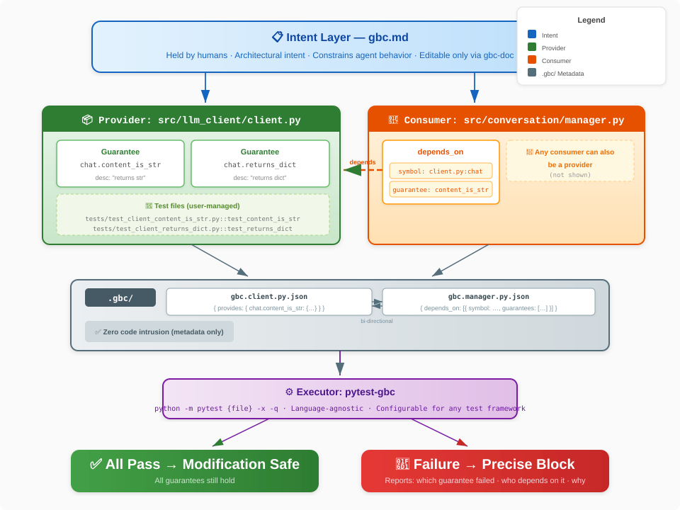

# Core Concepts

> Language: [简体中文](../zh/concepts.md) | **English**

This page explains GBC's core concepts — what it actually protects, and how. To get hands-on first
see [quick-start.md](./quick-start.md); for the workflow see [workflow.md](./workflow.md).

---

## The problem: when changing code, how do you know what must not break?

A coding agent's core failure mode isn't writing wrong code — that can be retried. The real problem
is **silently breaking the implicit assumptions of existing code**. When an agent changes a
function's return format, other modules that depend on that format can quietly break — with no
mechanism telling the agent those dependencies exist, and none stopping it when the break happens.

## The core idea: turn implicit dependencies into explicit guarantees

Dependencies between code are essentially a set of **guarantees**. Module A depends on module B not
on B's implementation details, but on some of B's behavioral promises — the type, format, semantics
of return values.

Make those guarantees **explicit, executable, and verifiable** and you get:

- Every change mechanically verifies whether all guarantees still hold;
- When a guarantee breaks, you know exactly which one and who depends on it;
- **Correctness shifts from "the AI thinks it got it right" to "every depended-on guarantee still
  passes"** — a mechanically verifiable boolean.


---

## Architecture



### Three design principles

1. **Zero source intrusion**: all metadata lives under the target project's `.gbc/` directory —
   no source edits, no decorators/annotations.
2. **Tests are user-owned**: GBC does not generate, store, or manage the test files themselves.
   You organize tests your own way in your own project; GBC only **records which test backs which
   guarantee, runs them, and aggregates results**.
3. **Language-agnostic**: any language and test framework, via executor config.

---

## Two layers of contract

GBC pins down the impact of a change with two layers:

1. **Intent layer**: in `.gbc/**/gbc.md`. Natural language (Markdown) defining a folder's role,
   internal constraints, and architectural intent. It is the source of truth — it tells an agent
   "what you should and shouldn't do here." **Human-held**; the agent only drafts.
2. **Guarantee layer**: in `.gbc/**/*.json`. Executable, test-backed concrete behavioral promises.

When changing code, the agent must honor both the intent layer (don't violate the original purpose)
and the guarantee layer (don't break concrete behavior).

How to write intent docs (the three sections: intent / internal constraints / files) is in
[workflow.md](./workflow.md#writing-intent-docs).

---

## Core terms

- **Provider**: the source file that offers a guarantee (e.g. `src/llm_client/client.py`).
- **Consumer / Dependent**: a file depending on a guarantee (e.g. `src/conversation/manager.py`).
- **Guarantee**: a **named** behavioral promise (id shaped `<symbol>.<behavior>`, path-free),
  backed by a test + a description. **Multiple consumers may share one guarantee.**
- **Executor**: config defining how to run tests (command template, working dir, env vars, ...).

### Two tiers of dependency edge

- **Symbol dependency (free)**: depends only on a signature or a symbol existing; no test, no
  reverse edge.
- **Named guarantee dependency**: depends on concrete behavior. Registered **both ways** via the
  reverse-edge mechanism — the provider's `provides[id].dependents` ⇄ the consumer's
  `depends_on[].guarantees`, kept in sync by the tooling.

> Default to free symbol dependencies; upgrade to a named guarantee **only** when you depend on
> concrete behavior (not just a signature), and upgrade lazily.

---

## The unbreakable core invariants

Whichever surface you swap in — CLI / MCP / a future GUI — these engine-level invariants hold:

- **Guarantees are first-class; identity is a named id** (e.g. `get_config.never_none`, ≠ a test
  path).
- **Many-to-one**: one guarantee can be shared by many consumers; hitting an existing one appends
  a dependent and reuses it, rather than writing a second test.
- **Two-section self-contained meta**: one `.gbc` json per code file, `provides` (as provider) +
  `depends_on` (as consumer).
- **Born-green**: on create / test change the test runs on the spot, and registration is refused
  if it fails — the one integrity invariant, with no backdoor.
- **Retirement protection**: a guarantee with dependents refuses deletion.
- **Binary gate**: a test that ran is pass or fail; one that was skipped (heavy) is reported loudly
  but never turns the gate red. Green = no failures.
- **heavy** is a cost rank (int) + an auto-run authorization: batch runs only heavy ≤ threshold;
  a named verify ignores it.

### What a meta file looks like

`client.py` (provider), at `.gbc/src/llm_client/gbc.client.py.json`:

```json
{
  "provides": {
    "chat.content_is_str": {
      "desc": "chat()'s result['content'] is a str; manager concatenates it into history directly",
      "test": "tests/test_client_content_is_str.py::test_content_is_str",
      "executor": "pytest-myproject",
      "heavy": 0,
      "dependents": ["src/conversation/manager.py"]
    }
  }
}
```

`manager.py` (consumer), at `.gbc/src/conversation/gbc.manager.py.json`, records the reverse edge:

```json
{
  "depends_on": [
    {
      "symbol": "src/llm_client/client.py:chat",
      "guarantees": ["chat.content_is_str"]
    }
  ]
}
```

Both directions are written by the tools (CLI / MCP); you don't hand-edit them.

---

## What it is not

GBC is **not** another AI coding assistant challenging Cursor or Aider. It fills the piece they lack
in large, complex projects: a **machine-verifiable boundary for change**.

- **Works with Cursor / Aider**: they're good at finding and editing code, but lack explicit
  awareness of cross-module dependencies and thus break things silently. GBC gives them a
  "constraint guardrail" — check the dependency tree before, and pass all relevant guarantees
  after.
- **Different from CI**: CI is after-the-fact — it catches errors after commit. GBC is
  admission-based — a gate inside the agent's workflow, catching errors before they land, inside
  the agent's context.

### How it differs from existing ideas

**"Isn't this just Design by Contract?"** Traditional contract programming has a module declare its
**own** contract. GBC's key differences: a guarantee is **registered by the dependent** ("what
behavior of yours I rely on" comes from the user), it **carries attribution** (who registered it
and why, so breaking it pinpoints impact), and it **targets AI agents** (a boundary for change,
not a runtime check).

**"Isn't this just testing?"** Technically a guarantee is a test file. Conceptually: it **carries
attribution** (records who registered it, which cross-module dependency it protects), it's a
**live gate** (not run after-the-fact in CI, but an admission condition when the agent changes
code), and it's **user-managed** (GBC manages the metadata and running, not the test files
themselves).

---

## Limitations (stated honestly)

- **Protection ceiling = test quality**: GBC only catches what a test can catch. Tests that only
  walk the happy path make guarantees a false sense of safety. (Happy-path-only tests are the
  textbook example.)
- **Manual registration cost**: dependencies must be registered by an agent or human. The per-edge
  cost is small, but coverage takes ongoing investment as the project grows.
- **Run performance**: every verification really runs tests, so there's some latency cost.
